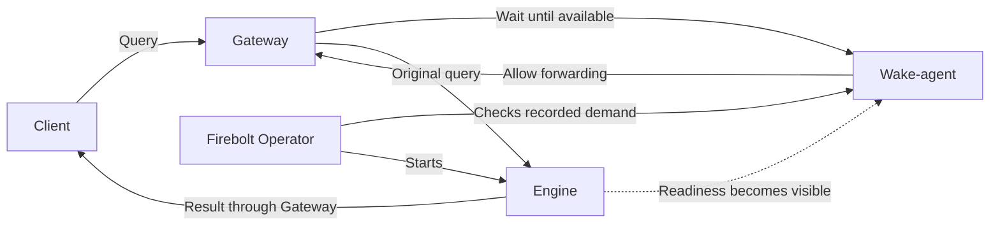

# How Engine wake-up works

When a query arrives for a stopped Engine, the Gateway keeps the request open while the Firebolt Operator starts the Engine. Once the Engine is available, the Gateway can send that same query onward. The client does not need to submit a second query for the normal wake-up flow.

There is a gap between the Engine becoming available and the query reaching it. During that gap, the Engine can still appear idle. **Wake protection temporarily prevents idle shutdown so the waiting query has time to arrive.** This protection is bounded: if becoming available or delivering the query takes too long, shutdown can still race with delivery.

For user configuration, see [Auto-stop and wake-up](../../docs/engine/auto-stop-and-wake-up.mdx).

## Who does what?

| Component | Responsibility |
| --- | --- |
| Client | Sends a query and waits for its response. |
| Gateway | Keeps the original request open, then forwards it to the Engine. |
| Wake-agent | A helper in each Gateway that records requests for unavailable Engines and tells the Gateway when it can proceed. |
| Firebolt Operator | Notices the recorded demand, remembers the wake protection deadline, and starts the Engine. Later, it checks whether the Engine can stop. |
| Engine | Starts, becomes available, and executes queries. Its activity informs idle shutdown decisions. |



The Gateway holds the query; the Firebolt Operator sees only that someone requested the Engine. It does not receive SQL or manage a queue of queries.

## Timeouts and deadlines used in this guide

A **timeout** is a duration. A **deadline** is the point in time when that duration runs out. The query's hold deadline and the Engine's wake protection deadline are independent.

| Term used below | Code or configuration | Meaning |
| --- | --- | --- |
| **Hold timeout / hold deadline** | Wake-agent `Config.HoldTimeout`; `DefaultHoldTimeout = 120s`; agent flag `--hold-timeout` | One timer per admitted query, started in `handleHold` after hold admission. Waiting for Engine readiness and checking routing consume this same timer. The hold deadline is its start time plus `HoldTimeout`. |
| **Agent-call timeout** | `gatewayWakeHoldTimeoutMillis = 125_000` | How long Envoy's call to the wake-agent may take. Starts when Envoy calls the agent, slightly before the agent starts the hold timer. It is longer so the agent can return its own decision first. |
| **Stream idle timeout** | `gatewayStreamIdleTimeoutSeconds = 300` | Envoy's separate limit on stream inactivity. It is not the Engine idle timeout or a fresh routing-check budget. |
| **Engine idle timeout** | Effective `autoStop.idleTimeout`; `DefaultAutoStopIdleTimeout = 30m` | How much Engine inactivity permits idle scale-down, subject to schedules and wake protection. |
| **Wake protection window / wake protection deadline** | `WakeProtectionMultiplier = 6`; `status.wakeProtectionUntil` | The window is six times the effective Engine idle timeout at acceptance. Its deadline is measured from `status.lastWakeDemandTime`, not from readiness or a query's hold-timer start. |
| **Demand freshness limit** | `DefaultAutoStopWakeTTL = 5m` | Demand must be less than this age and not in the future when accepted. This is an acceptance check, not a query timeout or the protection window. |
| **Client timeout** | Set by the caller | Independently limits how long the client waits. The client can leave before any of the above limits is reached. |

The values come from [wake-agent configuration and `handleHold`](../../internal/wakeagent/agent.go), [Gateway timeout constants](../../internal/controller/instance_gateway.go), and [auto-stop policy](../../internal/controller/engine_autostop.go). The agent flag is defined in [the wake-agent command](../../cmd/wakeagent.go). Changing `--hold-timeout` alone does not change Envoy's agent-call timeout; keep the outer timeouts longer than the hold timeout.

## A normal wake-up, step by step

```mermaid
sequenceDiagram
    participant C as Client
    participant G as Gateway
    participant W as Wake-agent
    participant O as Firebolt Operator
    participant E as Engine
    C->>G: Send query
    G->>W: Can this Engine receive it?
    W->>W: Record demand; wait for availability
    Note over C,G: Original request stays open
    O->>W: Check for wake demand
    W-->>O: Latest request time
    O->>O: Save lastWakeDemandTime and wakeProtectionUntil
    O->>E: Start Engine
    Note over O,E: Protection prevents idle shutdown
    E-->>W: Ready endpoints become visible
    W->>G: Check that routing reaches the Engine
    G->>E: Readiness probe
    E-->>G: Ready
    G-->>W: Routing works
    W-->>G: Release the waiting request
    G->>E: Forward original query
    E-->>G: Query result
    G-->>C: Query result
```

1. If the Engine is already available, the request proceeds immediately without recording wake demand.
2. Otherwise, the wake-agent records the request time and waits. The Firebolt Operator regularly checks these records. With multiple Gateways, it uses the newest request time reported for that Engine.
3. Before starting the Engine, the Firebolt Operator saves the accepted request time (`status.lastWakeDemandTime`) and wake protection deadline (`status.wakeProtectionUntil`) in the Engine's stored status. This lets protection survive a Firebolt Operator restart.
4. The Engine starts through its normal lifecycle. Once its desired replica count is nonzero, the Firebolt Operator stops collecting wake demand for it. Becoming nonzero means startup was requested, not that the Engine is ready.
5. The wake-agent observes availability and checks routing through the Gateway before releasing the query. The routing check shares the query's original **hold deadline** (`Config.HoldTimeout`); it does not start a new hold timer. If the hold timeout is 120 seconds and readiness takes 100 seconds after that timer starts, only 20 seconds remain for routing checks. When the hold deadline is reached, the agent allows forwarding if the Engine has ready endpoints, even if routing has not been confirmed. That forwarding attempt can fail. Without ready endpoints, the Gateway returns `503` to the client.
6. Query activity keeps the Engine running under normal idle tracking. After the wake protection deadline (`status.wakeProtectionUntil`) passes, an Engine that remains idle can stop.

## What wake protection means

The two settings answer different questions:

- **Engine idle timeout (`autoStop.idleTimeout`):** How long can the Engine be inactive before idle shutdown is allowed?
- **Wake protection (`status.wakeProtectionUntil`):** How long should accepted wake demand prevent idle shutdown while the Gateway has an opportunity to deliver its query?

The wake protection window is **six times the effective Engine idle timeout** (`WakeProtectionMultiplier * idleTimeout`), measured from `status.lastWakeDemandTime`. It starts at demand, not when the Engine becomes ready. Six provides an allowance for startup and delivery; it is not a guarantee that every wake-up fits within the window. Longer idle timeouts therefore also keep a newly woken Engine protected longer.

The Firebolt Operator remembers two fields:

| Field | Meaning |
| --- | --- |
| `status.lastWakeDemandTime` | The original request timestamp that was accepted. |
| `status.wakeProtectionUntil` | The wake protection deadline, calculated using the Engine idle timeout at acceptance and rounded up to whole seconds. |

Seeing the same request timestamp again does not restart protection. Changing `autoStop.idleTimeout` later does not change the saved `status.wakeProtectionUntil`. A newer accepted request uses the policy in effect when it is accepted. Disabling auto-stop clears the stored wake protection.

The demand freshness limit (`DefaultAutoStopWakeTTL`) determines whether to accept demand. It does not set the hold deadline or the wake protection deadline.

Protection only prevents idle shutdown. Scheduled capacity changes still apply, and activity checks continue. If activity cannot be checked successfully, the Firebolt Operator records a fresh grace period rather than treating missing information as proof of inactivity.

## When several queries arrive

Each query has its own hold deadline (`Config.HoldTimeout`). A new arrival updates the Gateway's latest request time, but it does not extend an earlier query's hold deadline. When the Engine becomes available, multiple waiting queries can proceed; there is no promise that they execute in arrival order.

This is a set of open requests, not a durable queue. More queries do not create more Engine replicas: wake-up requests the configured active capacity.

An important distinction is **recording a newer request versus accepting another wake**. The Gateway continues recording requests while the Engine is unavailable. Once the Firebolt Operator has requested startup, however, it stops collecting demand for that Engine because its desired replica count is no longer zero. Later arrivals during startup therefore do not continuously extend the saved wake protection deadline (`status.wakeProtectionUntil`).

## The remaining race

**If the Engine takes longer than expected to become available, or delivery is delayed, the wake protection deadline (`status.wakeProtectionUntil`) can pass while a query is still within its own hold deadline. Once the Engine is stable, idle shutdown can then happen before the query reaches it.**

```mermaid
sequenceDiagram
    participant G as Gateway
    participant O as Firebolt Operator
    participant E as Engine
    G->>G: Hold a query and record demand
    O->>O: Accept wake; save wakeProtectionUntil
    O->>E: Start Engine
    Note over O,E: Startup outlasts the wake protection window
    O->>O: wakeProtectionUntil passes
    Note over O,E: Creation continues after wake protection expires
    E-->>O: Engine becomes stable
    Note over G,E: A query is still waiting; Engine may appear idle
    alt Delivery and activity observation happen first
        G->>E: Forward waiting query
        E-->>O: Query activity observed
        O->>O: Keep Engine running
    else Idle shutdown happens first
        O->>E: Stop idle Engine
        G->>E: Attempt query delivery
        Note over G,E: Query can fail
    end
```

The waiting query in this diagram may be a later arrival. The original triggering query can already have reached its own hold deadline (`Config.HoldTimeout`).

### One query versus later arrivals

| Point in the workflow | Only the original query | More queries arrive while the Engine starts |
| --- | --- | --- |
| Startup begins | Original request waits. | Each request has its own hold deadline. |
| Original query reaches its hold deadline with no ready endpoints | It fails; creation continues. | It fails; newer requests can still be waiting. |
| Wake protection deadline passes during startup | Creation continues. | Creation continues; newer arrivals do not continuously renew protection. |
| Engine becomes stable | It may have no remaining query to serve. | Waiting queries can proceed, but delivery can race with idle shutdown. |
| Engine stops again | Reobserving the same accepted demand cannot renew protection. | Newer, still-fresh demand can cause another wake after replicas return to zero. |

Auto-stop does not make scale-down decisions while creation or another rollout transition is in progress. Neither a query reaching its hold deadline nor the Engine reaching its wake protection deadline cancels creation. Passing `status.wakeProtectionUntil` allows normal idle decisions once the Engine is stable; it is not itself a command to stop or delete the Engine.

A repeated wake does not restore a failed request. Under unfavorable timing, later demand can produce repeated wake/stop cycles. Extending the client timeout does not extend `Config.HoldTimeout`. Increasing `Config.HoldTimeout` does not extend `status.wakeProtectionUntil`, and also requires checking the separate Envoy agent-call and stream idle timeouts.

## Other outcomes to keep in mind

| Event | What happens |
| --- | --- |
| A client leaves while waiting | Its wait ends, but recorded demand remains. Startup can continue even if all clients leave. |
| The Gateway has no capacity to hold another request | The request is rejected with an unavailable response. Its arrival normally still records demand, so wake-up can continue. |
| A Gateway restarts | Its open requests and in-memory demand are lost; they are not replayed automatically. |
| The Firebolt Operator restarts | Accepted wake protection survives in Engine status. The Gateway continues owning its waiting requests. |
| The wake-agent is unavailable or has not loaded readiness information | The Gateway attempts ordinary routing. This does not guarantee that an unavailable Engine wakes or that the query succeeds. |
| The Engine becomes unavailable again just before delivery | A query can still fail; readiness observation does not reserve capacity or guarantee execution. |

## Where to look in the code

Keep implementation details in these sources rather than duplicating them throughout this guide:

- [Gateway request handling](../../internal/controller/instance_gateway.go) and [wake-agent](../../internal/wakeagent/agent.go): waiting, release, deadlines, and fallback behavior.
- [Demand tracking](../../internal/wakeagent/demand.go) and [readiness tracking](../../internal/wakeagent/readiness.go): multiple requests and shared availability notifications.
- [Firebolt Operator demand collection](../../internal/controller/wake_demand.go): collecting the newest request time for stopped Engines.
- [Auto-stop decisions](../../internal/controller/engine_autostop.go): accepting demand, persisting protection, schedule precedence, and idle shutdown.
- [Wake regression tests](../../internal/controller/engine_wake_handoff_test.go): replay, restart-related persistence, timeout changes, schedules, and activity grace.

The live handoff test holds back one query after the Engine is ready and requires that same query to succeed without client retries. Its negative control checks failure with protection disabled. This validates delivery within the protected window, not arbitrary startup delays or guaranteed delivery after the wake protection deadline. See [handoff validation and model boundaries](../testing/formal-verification.md) for the test workflow.
