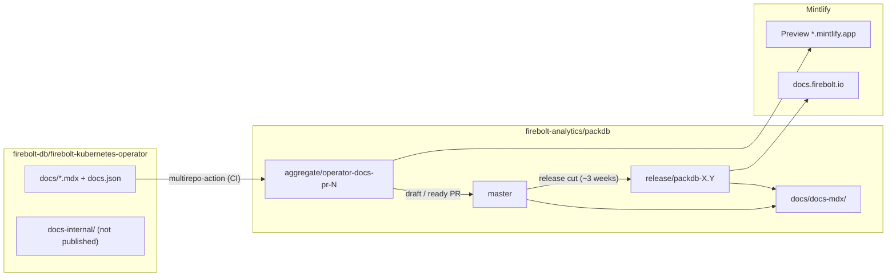
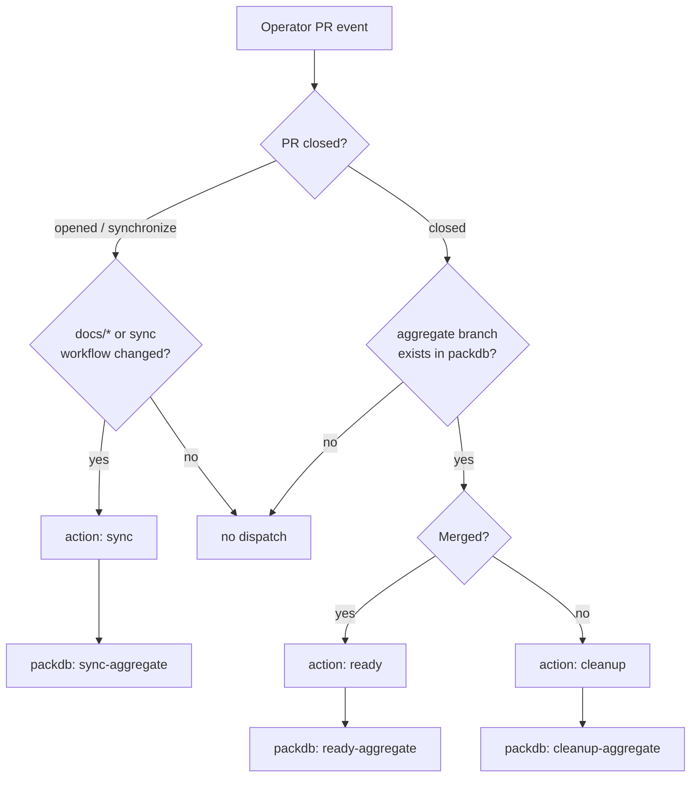
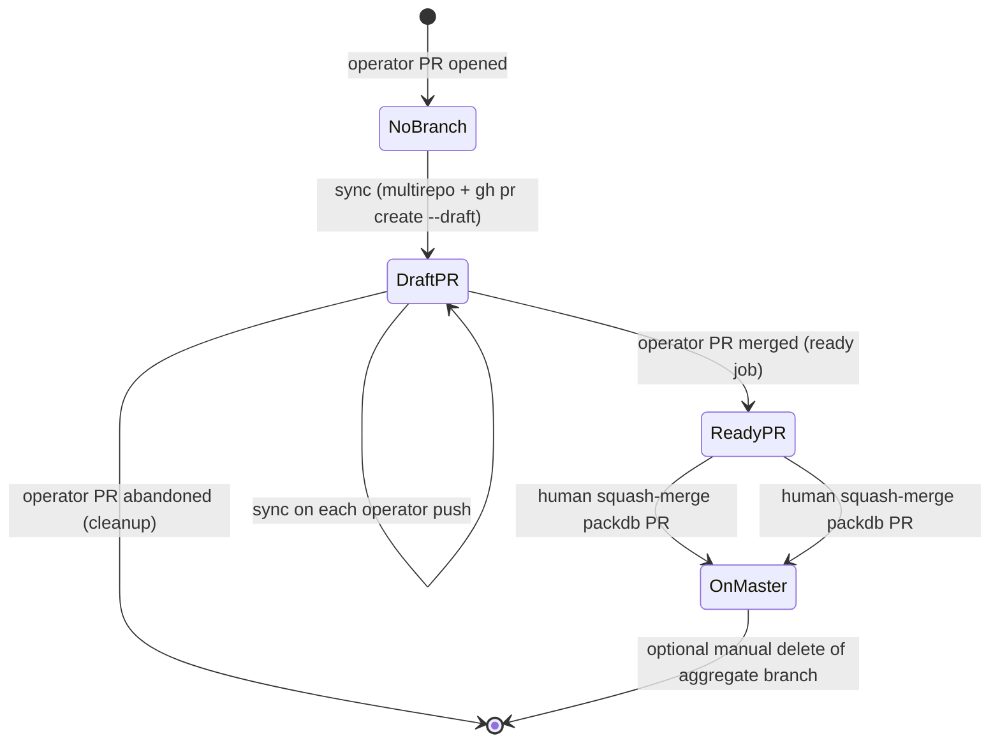
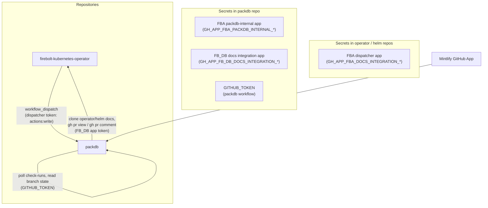
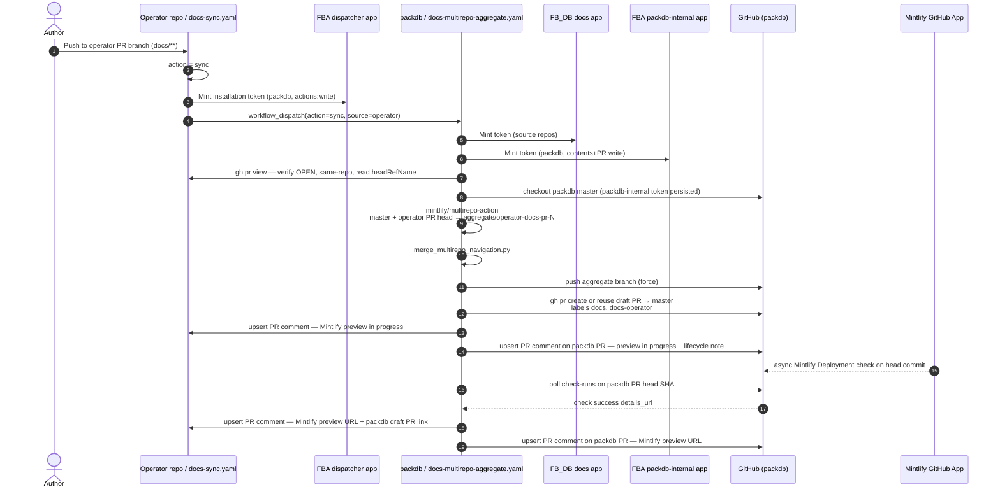
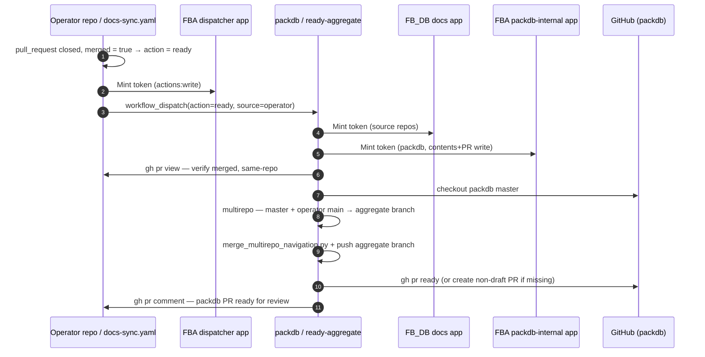
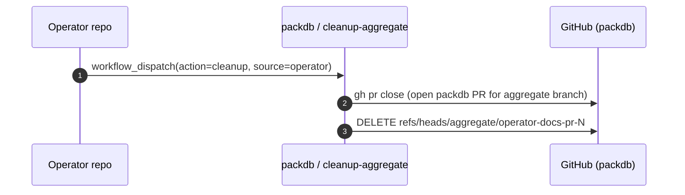
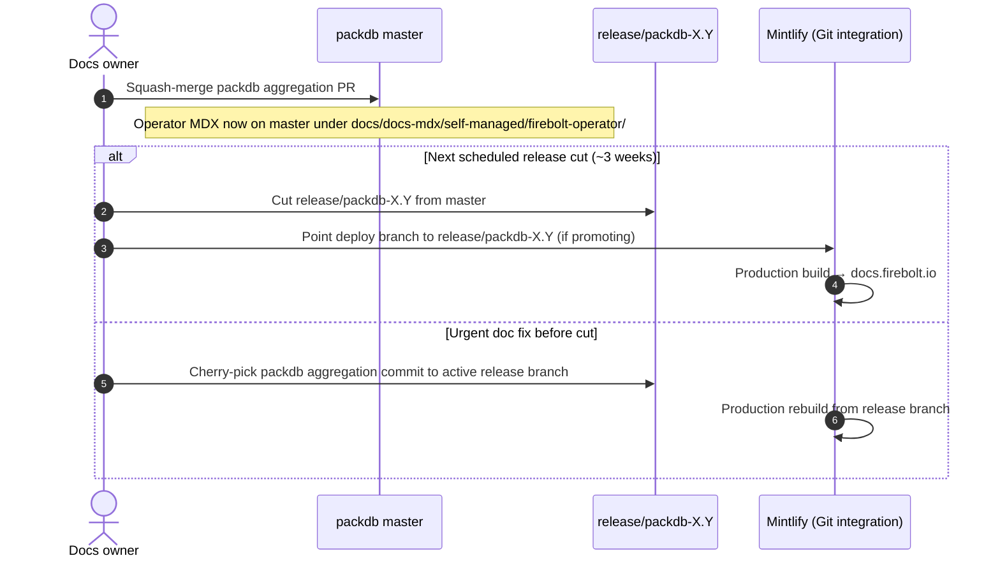

# Documentation workflow (operator → packdb → Mintlify)

Internal reference for how Kubernetes Operator docs reach [docs.firebolt.io](https://docs.firebolt.io). Published contributor docs live in [`docs/`](../docs/README.md); this file is **not** aggregated.

## At a glance

Operator documentation is authored next to the operator code, aggregated into the main Firebolt Mintlify site in [`firebolt-analytics/packdb`](https://github.com/firebolt-analytics/packdb), and published from packdb release branches. Mintlify only watches **one packdb Git branch** at a time (for example `release/packdb-4.31`); it does not read the operator repository directly.



## Repository layout

| Location | Repo | Published? | Role |
| --- | --- | --- | --- |
| [`docs/`](../docs/) | operator | Yes | MDX pages + `docs.json` navigation fragment merged into the Firebolt site under **Documentation → Self-Managed → Firebolt Operator** |
| [`docs-internal/`](../docs-internal/) | operator | No | Design notes, SDLC, slides — outside the multirepo path |
| `docs/docs-mdx/` | packdb | Yes | Full Mintlify site (theme, tabs, SQL examples, redirects) |
| `docs/docs-mdx/self-managed/firebolt-operator/` | packdb (generated) | Yes | Copy of operator `docs/` produced by CI — do not edit by hand |

Operator `docs.json` defines **navigation only**. Global Mintlify settings (`docs/docs-mdx/docs.json` in packdb) own theme, tabs, redirects, and site metadata.

After aggregation, packdb runs [`merge_multirepo_navigation.py`](https://github.com/firebolt-analytics/packdb/blob/master/docs/scripts/merge_multirepo_navigation.py) to nest the **Firebolt Operator** group under **Documentation → Self-Managed** (required because packdb uses tabbed navigation).

## Workflows and entry points

| Workflow | Repository | Trigger |
| --- | --- | --- |
| [`.github/workflows/docs-sync.yaml`](../.github/workflows/docs-sync.yaml) | operator | Same-repo PR (opened, reopened, synchronize, closed). `sync` requires a `docs/**` or `.github/workflows/docs-sync.yaml` change; `ready`/`cleanup` on close are gated on the existence of the packdb aggregate branch |
| [`.github/workflows/docs-multirepo-aggregate.yaml`](https://github.com/firebolt-analytics/packdb/blob/master/.github/workflows/docs-multirepo-aggregate.yaml) | packdb | `workflow_dispatch` (inputs `action`, `source`, `source_pr_number`), triggered by the operator/helm sync workflows or run manually |

An in-job relevance check (not a trigger-level `paths` filter) on the operator workflow means changes under `docs/`, or edits to the sync workflow file itself, trigger `sync` aggregation. Edits confined to `docs-internal/` do not. The relevance check is intentionally **not** used to gate the `closed` event so that cleanup/ready still run for a PR whose final diff no longer touches `docs/`; the close action is resolved from the packdb aggregate branch instead.

`docs/docs-mdx/` is not a separate deploy target — it is the Mintlify site root **on** whichever packdb branch is built (`aggregate/operator-docs-pr-{N}` for previews, `release/packdb-*` for production).

## Dispatch model

The operator workflow never pushes to packdb. It triggers the packdb aggregation workflow with a `workflow_dispatch` carrying a small, allowlisted set of inputs:

```bash
gh workflow run docs-multirepo-aggregate.yaml \
  --repo firebolt-analytics/packdb \
  --ref master \
  -f action="sync | ready | cleanup" \
  -f source=operator \
  -f source_pr_number=123
```

`workflow_dispatch` is used instead of `repository_dispatch` so the cross-repo dispatcher App only needs **Actions: write** on packdb rather than **Contents: write** (see [Actors and credentials](#actors-and-credentials)). GitHub resolves the workflow file from packdb's default branch (`master`), so the renamed `docs-multirepo-aggregate.yaml` must already be on `master` before the operator side can target it.

Packdb resolves all Git refs itself (operator PR head, `main`, branch names). It does **not** trust client-supplied branch names. The only inputs are `action`, a fixed `source`, and the source PR number.

On `opened` / `reopened` / `synchronize`, the operator workflow uses the PR's current file list to decide whether to `sync`. On `closed` it does **not** rely on the file list — the merged diff is an unreliable proxy for whether a `sync` ever ran. Instead it queries packdb for the aggregate branch `aggregate/operator-docs-pr-{N}` (created only by `sync`). If the branch exists, a merged PR is marked `ready` and an abandoned one is `cleanup`'d; if it does not exist, nothing is dispatched. This guarantees a merged docs PR is never accidentally torn down because its final diff no longer matched `docs/*`, and avoids dispatching no-op `cleanup` events for closed non-docs PRs.



| `action` | Operator trigger | Packdb job | Outcome |
| --- | --- | --- | --- |
| `sync` | PR opened or updated | `sync-aggregate` | Aggregate branch updated; **draft** packdb PR (labels `docs`, `docs-operator`); in-progress Mintlify comments on operator + packdb PRs; wait for preview (GitHub App check by default); comments updated with preview URL |
| `ready` | PR merged | `ready-aggregate` | Re-aggregate from operator `main`; packdb PR marked **ready for review**; comment on operator PR |
| `cleanup` | PR closed without merge | `cleanup-aggregate` | Close packdb PR; delete aggregate branch |

Fork PRs are ignored on the operator side (`head.repo == base.repo`). Packdb rejects aggregation if the operator PR head is not `firebolt-db/firebolt-kubernetes-operator`.

## Branches and pull requests

Naming is strict and allowlisted in packdb CI:

| Artifact | Pattern | Example |
| --- | --- | --- |
| Aggregate branch | `aggregate/operator-docs-pr-{N}` | `aggregate/operator-docs-pr-42` |
| Packdb integration PR | base `master`, head aggregate branch | `docs: aggregate Kubernetes Operator docs (operator #42)` |
| Operator docs source (after merge) | `main` | — |
| Packdb integration base | `master` | — |
| Live Mintlify deploy branch | `release/packdb-X.Y` | `release/packdb-4.32` |

**Nothing is pushed to `master` by automation.** The bot only force-pushes the aggregate branch. Humans squash-merge the packdb PR through normal review.

### PR state machine (packdb)



While the operator PR is open, the packdb PR stays a **draft** and its head branch is updated on every `sync`. After the operator PR merges, the packdb PR becomes **ready for review** but remains open until a docs owner merges it.

**Packdb PR reuse:** While an open packdb PR exists for the aggregate branch, `sync` reuses it. If that packdb PR was **closed without merge** but the operator PR is still open, the next `sync` opens a **new** draft PR (it does not reopen the old one).

**Aggregate branch after success:** CI does not delete `aggregate/operator-docs-pr-{N}` when the packdb PR merges to `master`. Delete stale aggregate branches manually if desired.

## Call diagrams

### Actors and credentials

Credentials are split across two trust domains. The **operator/helm** repos only hold the dispatcher App key, and the **packdb** repo holds the keys that can write to packdb. No single key can both be triggered from a source repo and push to packdb.



| Token | Installed / used on | Permissions needed |
| --- | --- | --- |
| FBA dispatcher app (`GH_APP_FBA_DOCS_INTEGRATION_*`) | `packdb` (secrets stored in **operator** and **helm** repos; token minted in those sync workflows) | **Actions: write** (trigger `workflow_dispatch`) and **Contents: read** (query the aggregate branch on close) on `packdb`. Installed on packdb with only these two permissions, so a leaked source-repo key cannot push to packdb. |
| FBA packdb-internal app (`GH_APP_FBA_PACKDB_INTERNAL_*`) | `packdb` (secrets stored in **packdb** repo only; token minted in the packdb workflow) | **Contents: write** (push the aggregate branch) and **Pull requests: write** (create / ready the packdb PR). Installed solely on packdb. An App token (not `GITHUB_TOKEN`) is required here because `GITHUB_TOKEN`-authored pushes / PR transitions do not start new workflow runs, which would leave the required Master-CI-Gate check unreported. |
| FB_DB docs integration app (`GH_APP_FB_DB_DOCS_INTEGRATION_*`) | `firebolt-kubernetes-operator` + `firebolt-instance-helm` (secrets stored in **packdb** repo; token minted in packdb workflow) | Contents: read (clone source docs for multirepo) and Pull requests: read + write on the source repos (verify PR, post comments). |
| `GITHUB_TOKEN` | packdb workflow | `contents: write`, `pull-requests: write`, `issues: write`, `checks: read`. Used for read/poll operations inside packdb (Mintlify check runs, branch state). The aggregate-branch push and the PR ready flip are done with the packdb-internal App token, not `GITHUB_TOKEN`. |
| Mintlify GitHub App | packdb repo (dashboard install) | Automatic preview deployments on PRs targeting `master`; aggregation workflow reads `Mintlify Deployment` check `details_url` |

#### Multirepo source-clone token

[`mintlify/multirepo-action`](https://github.com/mintlify/multirepo-action) (and the `aggregate_multirepo_docs.py` clone step) need a token that can **read** the source repos in the `firebolt-db` org. The packdb workflow passes the **FB_DB app token** (`DOCS_AGGREGATE_TOKEN_OPERATOR` / `DOCS_AGGREGATE_TOKEN_HELM`) for that, because packdb's `GITHUB_TOKEN` cannot read private repositories in another org. The aggregate-branch push is a separate step authenticated with the packdb-internal App token via the checkout's persisted credentials.

### Sequence: `sync` (operator PR open / update)



Operator ref for multirepo: **PR head branch**. Packdb base content: **`master`**.

### Sequence: `ready` (operator PR merged)



Operator ref for multirepo: **`main`**. The aggregate branch name is still tied to the original operator PR number.

### Sequence: `cleanup` (operator PR closed without merge)



### Sequence: human path to production



Production deploys use Mintlify’s **GitHub integration** on the configured release branch. Operator-docs aggregate previews use the **Mintlify GitHub App** by default (`DOCS_AGGREGATE_USE_MINTLIFY_PREVIEW_API=false` in the workflow). Optional Preview API path is gated by that env var or manual `workflow_dispatch` input `use_mintlify_preview_api`.

## Operational notes

### PR comments (Mintlify preview)

- **`sync`** upserts a single comment on each PR (operator and packdb) using an HTML marker, so repeated pushes update the same comment instead of spamming new ones.
- Comments appear **before** Mintlify finishes building (“in progress”), then update with the preview URL when the deployment completes (or a fallback URL if polling times out).
- The packdb PR comment and body explain the automated lifecycle: marked **ready for review** when the operator PR merges, **closed** when the operator PR is abandoned.
- **`ready`** posts a separate comment on the **closed** operator PR after merge (`gh pr comment` works on closed PRs). That comment carries the packdb PR link for the human merge step.

### Mintlify preview timing

The `sync` job polls the packdb PR head commit for the **`Mintlify Deployment`** GitHub App check for up to ~15 minutes. The Mintlify app starts asynchronously after the aggregate branch push; the workflow waits for the check to appear, then for `conclusion=success`. If polling times out, it posts a deterministic **fallback** preview URL (`https://firebolt-{branch-with-dashes}.mintlify.app/`). The preview may need a few more minutes before it loads.

### Cherry-picks for urgent production

Cherry-pick the **packdb squash commit** on `master` (from merging the aggregation PR), not commits from the operator repository. Operator `main` alone does not update docs.firebolt.io until aggregated content is on packdb `master` and present on the Mintlify deploy branch.

## Author checklist

1. Edit or add `.mdx` under [`docs/`](../docs/); register pages in [`docs/docs.json`](../docs/docs.json).
2. Use lowercase hyphenated paths (Mintlify constraint).
3. Add YAML frontmatter (`title`, `description`, optional `sidebarTitle`) — see [`docs/README.md`](../docs/README.md).
4. Open a **same-repo** operator PR.
5. Watch for Mintlify preview comments on the operator PR and the packdb draft PR (in progress, then preview URL when ready).
6. Iterate on the operator PR; packdb draft PR and preview update automatically.
7. Merge the operator PR when code/docs review is done.
8. Find the **ready** packdb PR (linked in a follow-up comment on the merged operator PR).
9. Review and **squash-merge** the packdb PR into `master`.
10. For urgent live-site updates before the next release cut, cherry-pick the packdb squash commit onto the active `release/packdb-*` branch.

Keep design notes, SDLC, and slides in **`docs-internal/`** only.

## Security properties

| Control | Implementation |
| --- | --- |
| No fork aggregation | Operator workflow gate + packdb `headRepository` check |
| No `pull_request_target` | Operator workflow uses `pull_request` only; secrets not exposed to fork workflows |
| No trusted client refs | Dispatch inputs are limited to `action`, a fixed `source`, and `source_pr_number`; packdb reads all refs from the GitHub API |
| Least-privilege cross-repo trigger | Source repos hold only the dispatcher App key (`actions:write` + `contents:read` on packdb). The keys that can write to packdb (`contents:write`, `pull_requests:write`) live solely in the packdb repo |
| Allowlisted branch names | Regex `^aggregate/operator-docs-pr-[0-9]+$` before push, preview, or delete |
| No direct push to `master` | Bot pushes aggregate branch only; `master` via human PR merge |
| Preview exposure | Mintlify preview URLs are public; preview renders full Firebolt site from `master` + operator changes |

## Troubleshooting

### `gh workflow run` → HTTP 403 `Resource not accessible by integration`

`POST /repos/{owner}/{repo}/actions/workflows/{id}/dispatches` requires **Actions: write** on the target repo. (This is the reason the workflow moved off `repository_dispatch`, which would instead require **Contents: write**.)

**Checklist:**

1. FBA dispatcher app → repository permission **Actions: Read and write** (plus **Contents: read** for the close-time branch query).
2. App **installed** on `firebolt-analytics` with **`packdb`** in the installation (not operator-only).
3. After changing app permissions, **accept** the updated installation on the org/repo.
4. Operator repo secrets match this app (`GH_APP_FBA_DOCS_INTEGRATION_CLIENT_ID`, `GH_APP_FBA_DOCS_INTEGRATION_APP_KEY_PEM`).
5. Token mint step scopes to packdb (`owner: firebolt-analytics`, `repositories: packdb` in `docs-sync.yaml` — already correct).
6. Re-run the failed `docs-sync` job.

### Dispatch succeeds but packdb workflow never runs

`workflow_dispatch` resolves the workflow file from packdb's **default branch** (`master`) and is rejected (HTTP 422) if the workflow does not exist there. The renamed `docs-multirepo-aggregate.yaml` must be merged to packdb `master` **before** the operator side targets it. Merge the packdb workflow PR first, then re-dispatch from the operator PR.

## Manual recovery

On packdb, run **Aggregate Mintlify docs** (`workflow_dispatch`) with `source=operator`:

| Input | When to use |
| --- | --- |
| `action=sync`, `source=operator`, `source_pr_number=N` | Rebuild draft aggregate branch / draft PR while operator PR #N is still open |
| `action=ready`, `source=operator`, `source_pr_number=N` | Re-run post-merge aggregation and mark packdb PR ready |
| `action=cleanup`, `source=operator`, `source_pr_number=N` | Tear down after abandoned operator PR |

Concurrency group `docs-aggregate-operator-pr-{N}` cancels in-progress runs for the same operator PR.

## Related links

- Operator contributor guide: [`docs/README.md`](../docs/README.md)
- Packdb multirepo section: [packdb `docs/README.md`](https://github.com/firebolt-analytics/packdb/blob/master/docs/README.md#multirepo-aggregation-kubernetes-operator-docs)
- Mintlify multirepo action: [mintlify/multirepo-action](https://github.com/mintlify/multirepo-action)
- Mintlify GitHub App: [GitHub integration](https://www.mintlify.com/docs/deploy/github)
